# CR_BCN_meteo

Welcome to the **CR_BCN_meteo** repository.

This repository contains Python scripts for training and applying weather downscaling models. The models leverage the CatBoost library to provide high-resolution weather data, either from historical sources (ERA5-Land) or forecasting services (MeteoGalicia).

The data required for model training and prediction is stored in the NextCloud repository managed by our department at CIMNE.

---

## 📌 Authors

- **Anceline Desertaux** – anceline.desertaux@insa-lyon.fr  
- **Jose Manuel Broto** – jmbroto@cimne.upc.edu  
- **Gerard Mor** – gmor@cimne.upc.edu  

---

## 📁 Scripts Overview

### `catboost_model_training.py`

This script is used to train a CatBoost-based weather downscaling model. It supports both forecasting (MeteoGalicia) and historical (ERA5-Land) models.

#### Parameters

The main configurable parameters (located at the top of the script) include:

- `k_fore`: Set to `1` for MeteoGalicia (forecasting), `0` for ERA5-Land (historical).
- `model_name` & `model_extension`: Typically using `.cbm`; choose a clear and descriptive name.
- `N_hours`: Number of hours of data to use (e.g., `8 * 8760`).
- `n_steps`: Number of training chunks (`20 * 8` for ERA5-Land, `8 * 8` for MeteoGalicia).
- `n_harmonics`: Number of harmonics used in the Fourier transformation (typically `4`).
- Model hyperparameters: `iterations`, `learn_rate`, `depth`, `min_weight`.
- File directories: Especially `nextcloud_root_dir`, which should point to your local path to the NextCloud root folder.

#### Directory Structure (NextCloud)

The expected root path is: ClimateReady-BCN/WP3-VulnerabilityMap/Weather Downscaling/Models_and_predictions
Subfolders include:

- `Forecasting_MeteoGalicia`: Contains model artifacts and a `Predictions` subfolder.
- `Historical_ERA5Land`: Same structure for ERA5-Land models.
- `General_Data`: Holds all input datasets (.zarr), shapefiles, and static features needed for model training.

#### Saving Outputs

During training, the script saves:

- The trained model.
- Five `.npy` files (`high_min`, `high_max`, `low_min`, `low_max`, `xylatlon`) for normalization/de-normalization and geospatial reference.

#### Pretrained Models

Manually tuned hyperparameters have proven more reliable than grid search with sequential training. Parameters used in successful models:

- `N_hours = 8 * 8760`
- `n_steps = 25 * 8` (ERA5-Land) or `8 * 8` (MeteoGalicia)
- `n_harmonics = 4`
- `iterations = 100`

Hyperparameters for best models:

| Model Type     | `learn_rate` | `depth` | `min_weight` |
|----------------|--------------|---------|---------------|
| MeteoGalicia   | 0.04         | 6       | 8             |
| ERA5-Land      | 0.08         | 8       | 6             |

Model filenames:
- `cat_0_41.2,41.6_1.9,2.4_26280_200_4_400_0.03_6_4.cbm`
- `cat_1_41.2,41.6_1.9,2.4_26280_64_3_400_0.03_6_4.cbm`

For other model names, parameter values may differ.

---

### `historical_prediction.py`

This script generates high-resolution weather predictions from ERA5-Land historical data. It automatically obtains the needed low-resolution data from ERA5.

#### Key Parameters

- `model_name`: Use one of the models trained using `catboost_model_training.py`.
- `ym_range`: Year-month range, e.g., `[202201, 202212]`

---

### `real_time_prediction.py`

This script performs real-time weather downscaling based on MeteoGalicia forecast data. It automatically obtains the needed low-resolution data from MeteoGalicia Threeds server.

#### Key Parameters

- `model_name`: Use one of the models trained using `catboost_model_training.py`.
- `nd`: Number of previous days to include in the forecast.  
  For example:
  - `nd = 0` → forecasts from today (96 hours)
  - `nd = 1` → forecasts from today (96 hours) and yesterday’s forecast.
  - `nd = 2` → forecasts from today (96 hours) and forecasts made from the day before yesterday, and so on.

---

### `utils.py`

This script contains common utility functions used across the other scripts. No configuration required.

---

## 📝 Notes

- These scripts assume access to the weather datasets in NextCloud.
- Please adjust the `nextcloud_root_dir` to match your local path.

---

## 📊 Datasets Used

### Low-resolution weather historical data

The historical model’s dynamic input comes from the **ERA5-Land** dataset. This global hourly weather dataset spans from 1950 to the present and incorporates atmospheric forcing for enhanced accuracy. Its spatial resolution is ~0.1°, equivalent to ~9 km.

For our study, we focus on Catalonia, extracting data in the range:
- Latitudes: `41.2` to `41.6`
- Longitudes: `1.9` to `2.4`

This range is further refined during harmonization.  
Figure 1 shows the extracted points used in the historical (ERA5-Land) and target (UrbClim) datasets:

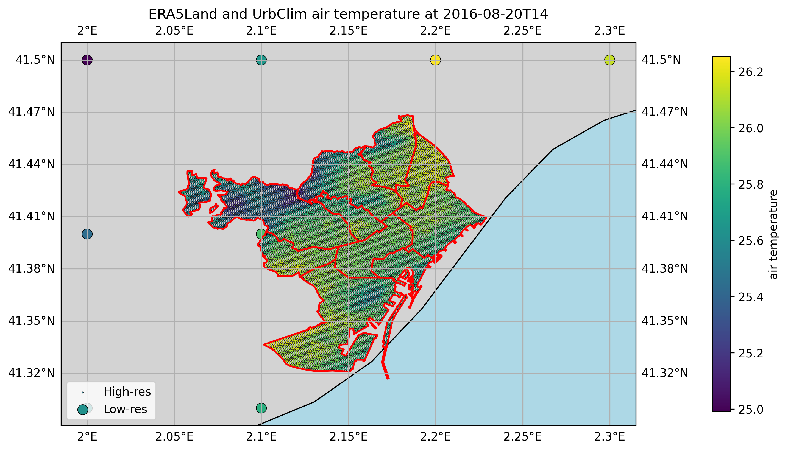  
**Figure 1.** Extraction points for ERA5-Land and UrbClim data.

The raw ERA5-Land variables are preprocessed into usable model inputs, as summarized below:

**Table 1. Processed ERA5-Land Variables**

| Raw Variable | Raw Name | Unit | Formatting | Formatted Variable | New Name | New Unit |
|--------------|----------|------|------------|---------------------|----------|----------|
| Air Temperature at 2m | t2m | K | °C conversion | Air Temperature at 2m | airTemperature | °C |
| Dew Point Temperature at 2m | d2m | K |  | Relative Humidity | relativeHumidity | % |
| U wind at 10m | u10 | m/s |  | Wind Speed | windSpeed | m/s |
| V wind at 10m | v10 | m/s |  | Wind Direction | windDirection | ° |
| Total Precipitation | tp | m | Daily → hourly, m → mm | Total Precipitation | totalPrecipitation | mm |
| Solar Radiation Down | ssrd | J/m² | Daily → hourly, → W/m² | GHI | GHI | W/m² |
| Leaf Area Index (low veg) | lai_lv | m²/m² | — | Low Veg Ratio | lowVegetationRatio | m²/m² |
| Leaf Area Index (high veg) | lai_hv | m²/m² | — | High Veg Ratio | highVegetationRatio | m²/m² |
| Forecast Albedo | fal | — | — | Albedo | albedo | — |
| Soil Temp (level 4) | stl4 | K | °C conversion | Soil Temperature | soilTemperature | °C |
| Soil Water Content (level 4) | swvl4 | m³/m³ | — | Soil Water Ratio | soilWaterRatio | m³/m³ |
| — | — | — | Calculated with pvlib | DHI, DNI, Sun Azimuth, Sun Elevation | — | — |

---

### Low-resolution weather forecasting data

The forecasting model’s input comes from **MeteoGalicia** via the **WRF (Weather Research & Forecasting)** model. It provides daily 96-hour forecasts at ~12 km resolution.

The same spatial extent as ERA5-Land is used.  
Figure 2 shows the data extraction points for MeteoGalicia:

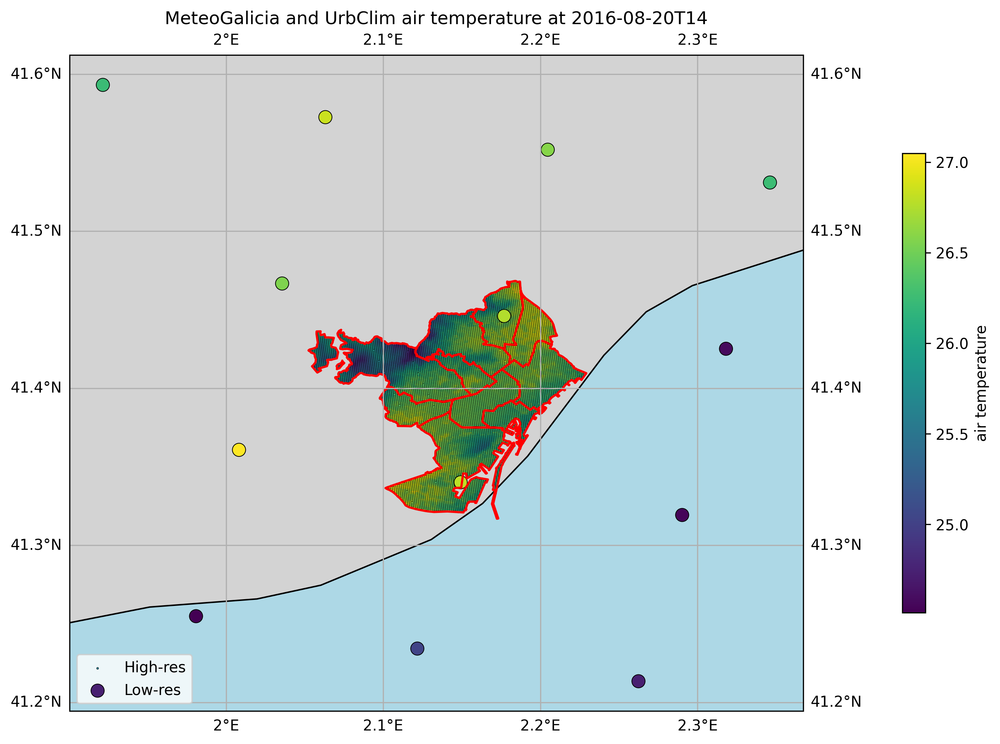  
**Figure 2.** Extraction points for MeteoGalicia and UrbClim data.

**Table 2. Processed MeteoGalicia Variables**

| Raw Variable | Raw Name | Unit | Formatting | Formatted Variable | New Name | New Unit |
|--------------|----------|------|------------|---------------------|----------|----------|
| Temp at 2m | temp | K | °C conversion | Air Temperature | airTemperature | °C |
| RH at 2m | rh | % | — | Relative Humidity | relativeHumidity | % |
| U Wind at 10m | u | m/s | — | Wind Speed | windSpeed | m/s |
| V Wind at 10m | v | m/s | — | Wind Direction | windDirection | ° |
| Accumulated Rain | prec | kg/m² | Already hourly, treated as mm | Total Precipitation | totalPrecipitation | mm |
| Shortwave Flux | swflx | W/m² | — | GHI | GHI | W/m² |
| — | — | — | pvlib-derived | DHI, DNI, Sun Azimuth, Sun Elevation | — | — |

This repository primarily focuses on this **forecasting model**.

---

### Static data

To enhance spatial resolution, static features are used as inputs. These are computed over a 100m grid aligned with UrbClim’s output resolution.

**Table 3. Processed Static Variables**

| Raw Variable | Unit | Processing | Formatted Variable | New Unit |
|--------------|------|------------|---------------------|----------|
| Elevation | m | Averaged over grid | Elevation Quantile | % |
| Built Area | m² | By typology (residential, office...) | Built Area Quantile | % |
| NDVI | — | Min, avg, max | NDVI Quantile | % |

Figure 3 illustrates some of these spatially distributed variables:

| 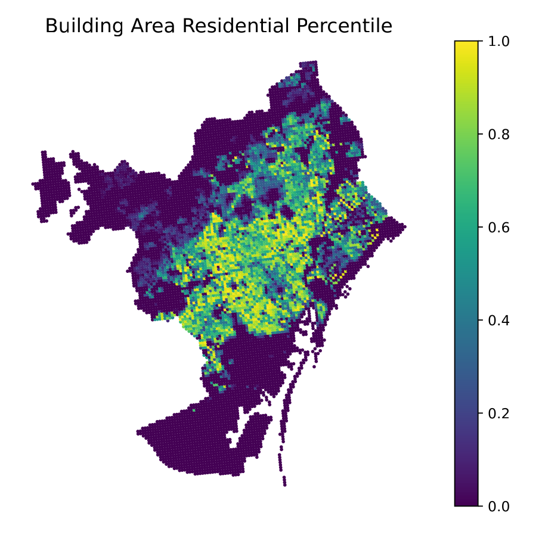 | 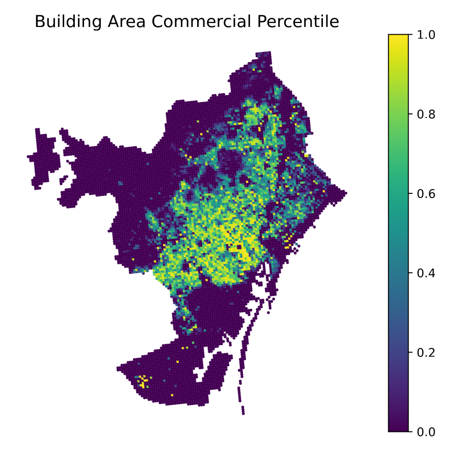 |
|-----------------------------|------------------------------|
| (a) Residential             | (b) Commercial               |
| 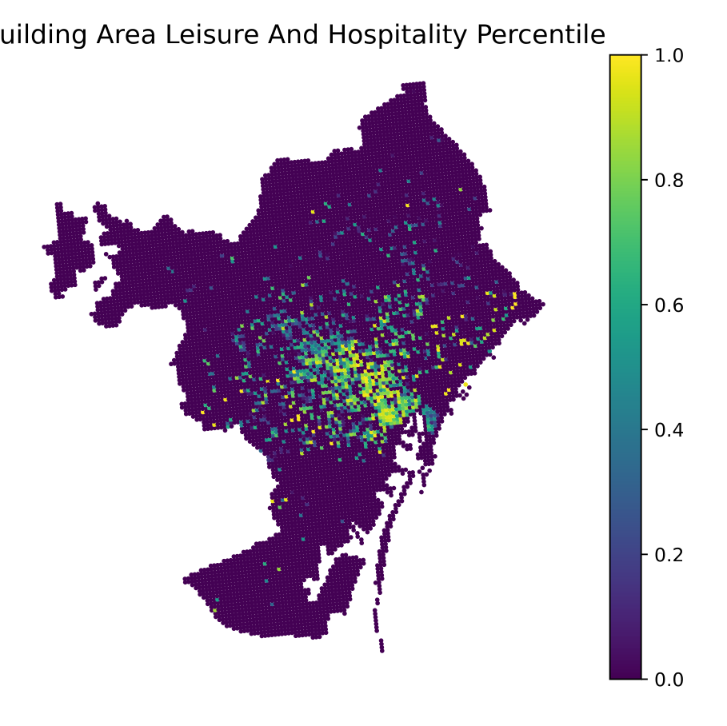 | 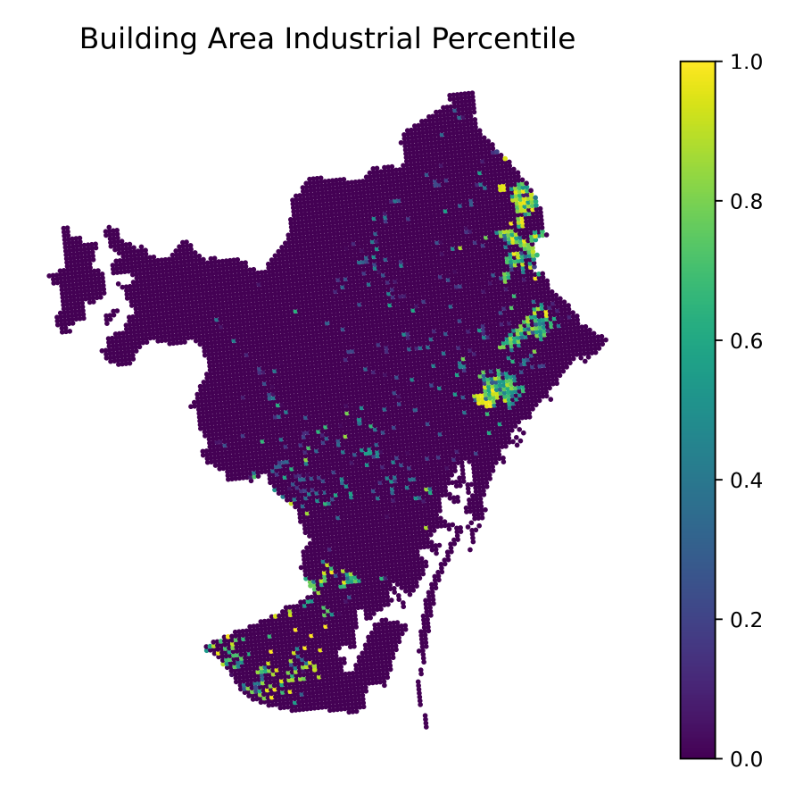 |
| (c) Leisure & Hospitality   | (d) Industrial               |
| 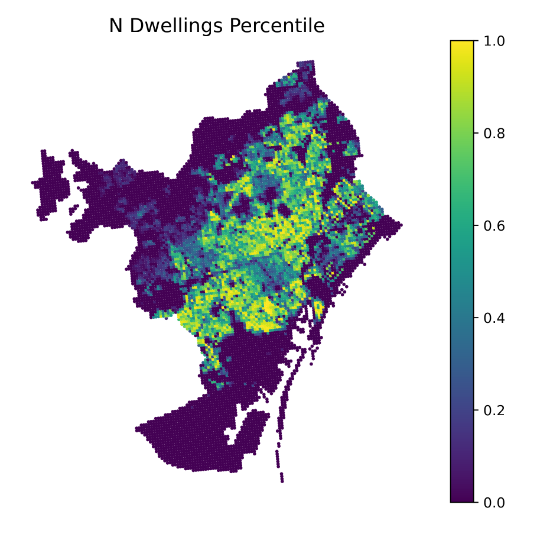 | 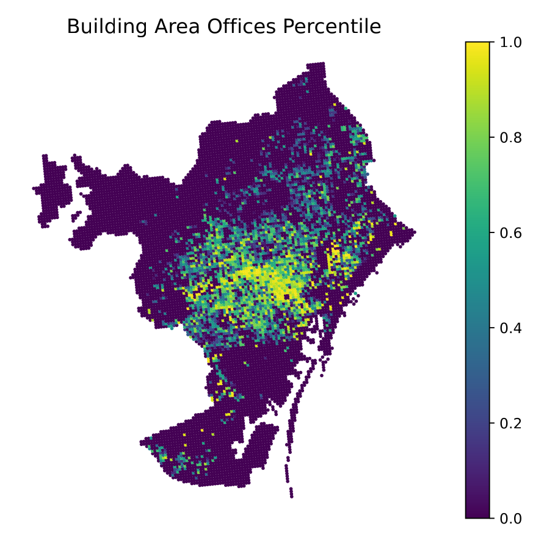    |
| (e) Dwellings               | (f) Offices                  |
| 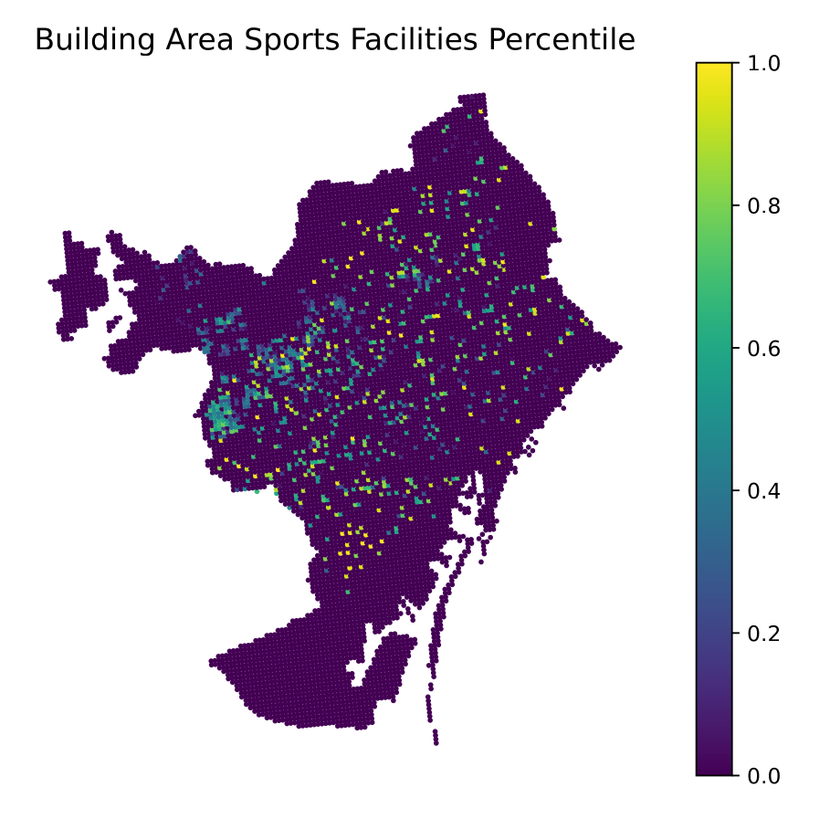     | 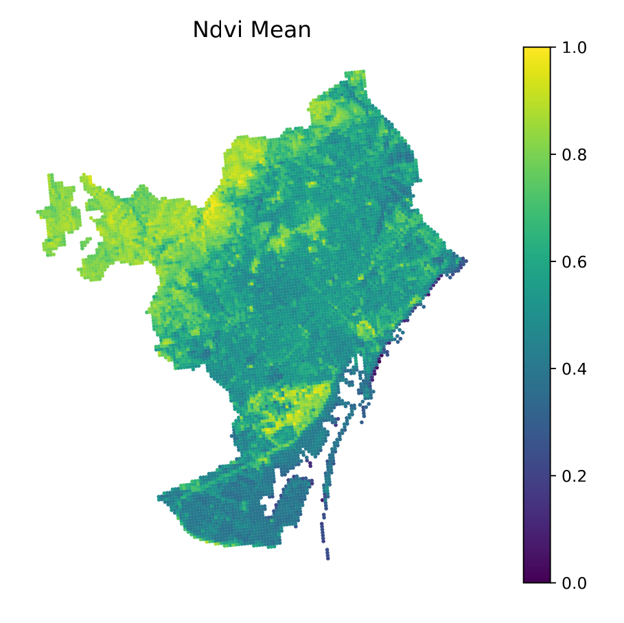  |
| (g) Sports Areas            | (h) NDVI Mean                |
| 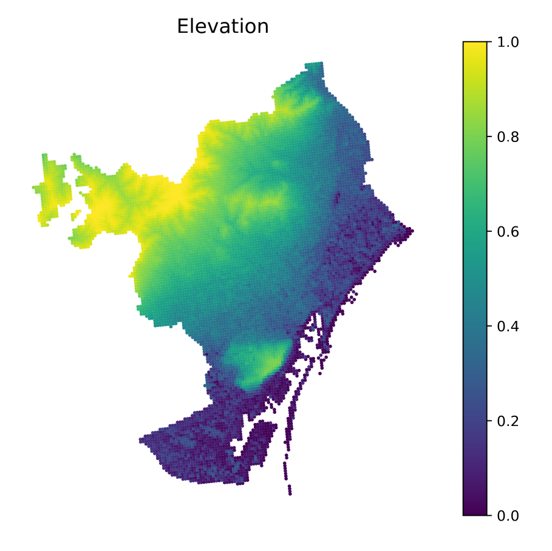  | 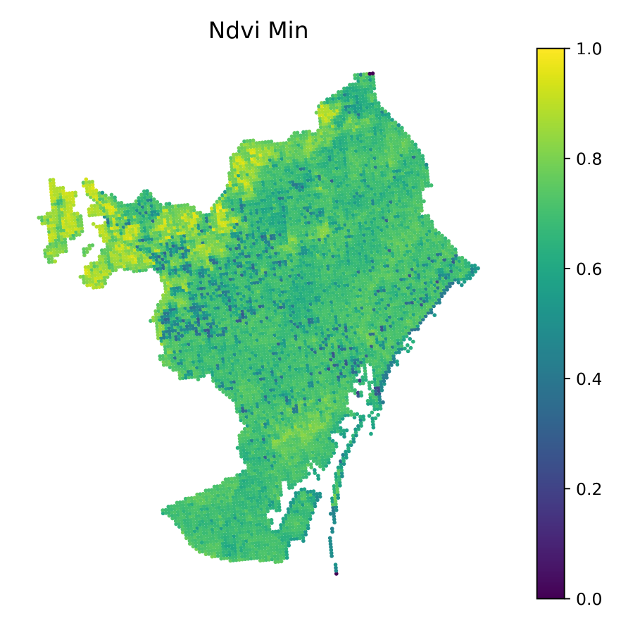   |
| (i) Elevation               | (j) NDVI Min                 |

**Figure 3.** Examples of spatial distribution for static inputs.

---

### High-resolution weather data (target)

The output for training is derived from the **UrbClim** model. Covering Barcelona at 100m resolution, it provides hourly data from 2008–2017.

UrbClim data is not publicly available but was kindly shared by the authors for research purposes. The aim is to approximate UrbClim predictions using the trained downscaling models.

**Table 4. Processed UrbClim Variables**

| Raw Variable | Raw Name | Unit | Formatting | Formatted Variable | New Name | New Unit |
|--------------|----------|------|------------|---------------------|----------|----------|
| Temp at 2m | T2M | K | °C conversion | Air Temperature | airTemperature | °C |
| Specific Humidity | QV2M | — | — | Relative Humidity | relativeHumidity | % |

---

## 📜 License

This project is licensed under the **European Union Public License (EUPL), Version 1.2**.  
You may obtain a copy of the license at:

[https://joinup.ec.europa.eu/collection/eupl/eupl-text-eupl-12](https://joinup.ec.europa.eu/collection/eupl/eupl-text-eupl-12)

Unless required by applicable law or agreed to in writing, software distributed under this license is distributed **on an "AS IS" basis**, without warranties or conditions of any kind.

© 2024 Anceline Desertaux, Jose Manuel Broto, Gerard Mor

---

Thank you for using **CR_BCN_meteo**!  
For any questions or suggestions, feel free to reach gmor@cimne.upc.edu
